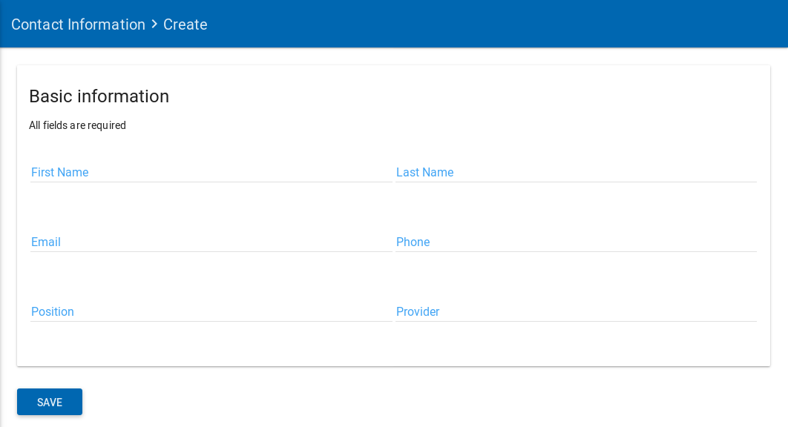
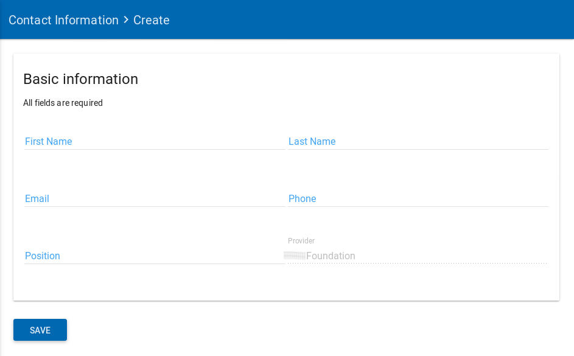
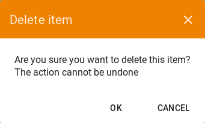

## Contacts Information List
To view the list of all contacts information, a `superadmin`, `admin` or `Service Admin` user must click to the **Contacts Information** left sidebar menu option.

|  |
|:--------------------:|
| *The Contacts Information page* |

## Details of a contact information
The user can view all the information from a selected contact information by clicking on the details view  icon.

|  |
|:--------------------:|
| *The details from a contact information* |

## Create a new contact information
To create a new Contact Information, the `superadmin`, `admin` or `service admin` must click to the **Contact Information** left sidebar menu option.

When the user clicks to the Contact Information option, a new page with the list of existing Contact Information is presented.

From this page a `superadmin`, `admin` or `service admin` user may create a new Contact Information just by clicking the **Create** option on the top right.

|  |
|:-------------------------------------:|
| *Create new contact information page* |

> Note: A `service admin` user can add a new contact information only for the provider to which it belongs.

> See in the following example how the user with role `service admin` cannot choose the provider.
>
> |  |
> |:----------------------------------:|
> | *Create new contact information from a service admin user* |

| Field Name                  | Description               |
| --------------------------- | ------------------------- |
| **Basic information**       |                           |
| First Name (**required**)		|	The user's first name	    |
| Last Name (**required**)		|	The user'sLast name		    |
| Email (**required**)				|	The user's email 		     	|
| Phone (**required**)				|	The user's phone      		|
| Position (**required**)			|	The position of the user  |
| Provider (**required**)			|	The provider of the user  |

## Edit a contact information
The `superadmin`, `admin` and `Service Admin` have the permission to edit a contact information.

To edit an existing contact information, the user should visit the list of contact information.

By clicking on the edit  icon near the selected contact information the user can edit the details of it.

The fields that the user can change are the same as the ones described in the previous section "Create new contact information" .

|  |
|:-------------------------------------:|
| *Edit a contact information page* |

## Delete a contact information

Only the `superadmin`, have the permission to delete a contact information.

To delete an existing contact information, the `superadmin` user should visit the list of Contact Information. By clicking on the delete  icon near the selected contact information the user can delete it.

|  |
|:--------------------------:|
| *The page will show you a confirmation message and if you agree, then this entry will be deleted.* |
