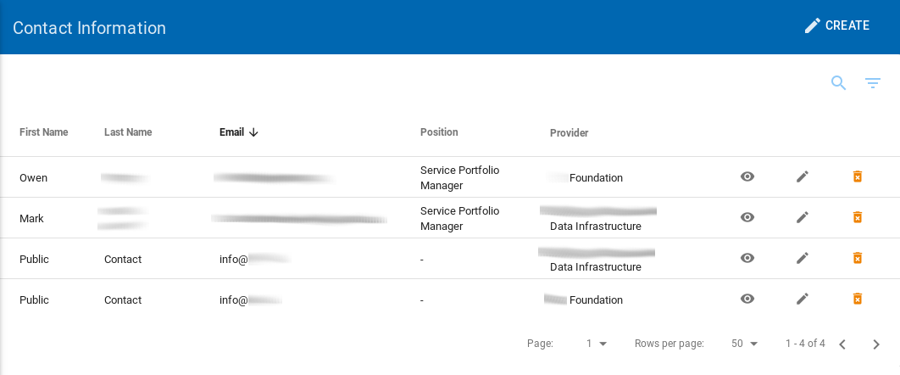
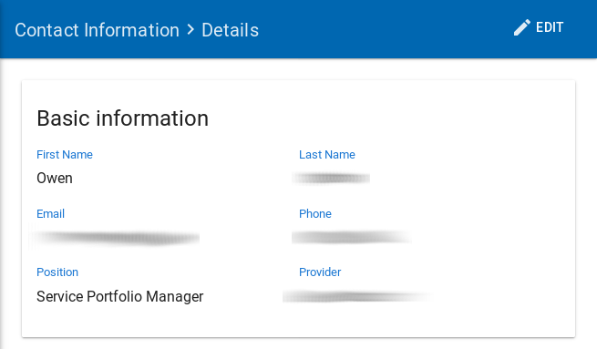
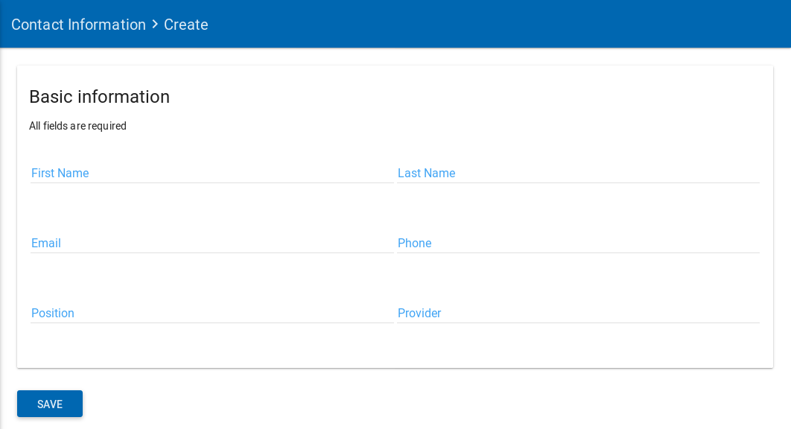
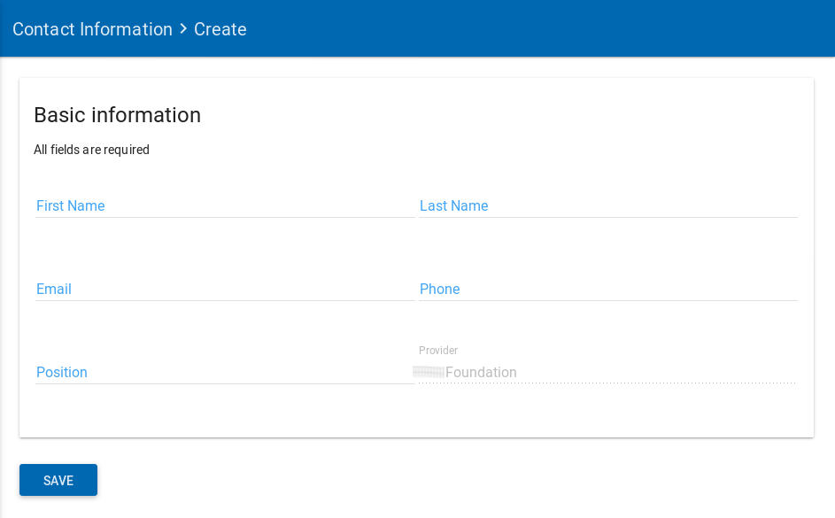
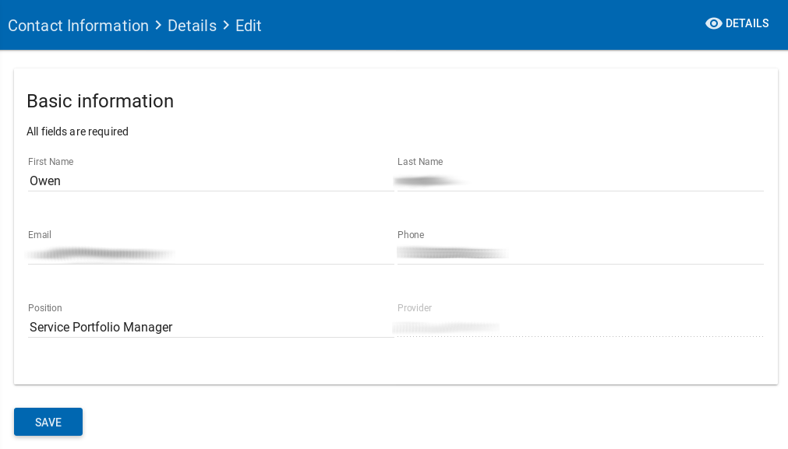

A *Contact Information* is actually a provider representative or an resource owner. The *Contact Information* is actually used by the  "Provider" or/and "Resources" as an owner or a Point of Contact.

:::tip

Before adding a Provider, or a Resource don't forget to add all the necessary contact information.

:::

## List Contact Information

To view the list of all contacts, a `Superadmin` or `Resource Admin` user must click to the **Contacts Information** left sidebar menu option.

|  |
|:--------------------:|
| *The Contacts Information page* |

## Contact Information details

The user can view all the information from a selected contact by clicking on the details view  icon.

|  |
|:--------------------:|
| *The details from a contact information* |

## Create a new Contact Information

To create a new Contact , the `Superadmin` or `Resource Admin` must click to the **Contact Information** left sidebar menu option.

When the user clicks to the Contact Information option, a new page with the list of existing Contact  is presented.

From this page a `Superadmin`, or `Resource Admin` user may create a new Contact  just by clicking the **Create** option on the top right.

|  |
|:-------------------------------------:|
| *Create new contact information page* |

> Note: A `Resource Admin` user can add a new contact information only for the provider to which it belongs.

> See in the following example how the user with role `Resource Admin` cannot choose the provider.
>
> |  |
> |:----------------------------------:|
> | *Create new contact information from a Resource Admin user* |

| Field Name                  | Description               |
| --------------------------- | ------------------------- |
| **Basic information**       |                           |
| First Name (**required**)		|	The user's first name	    |
| Last Name (**required**)		|	The user's Last name		    |
| Email (**required**)				|	The user's email 		     	|
| Phone (**optional**)				|	The user's phone      		|
| Position (**optional**)			|	The position of the user  |
| Provider (**required**)			|	The provider of the user  |

## Edit a Contact Information

The `Superadmin`, `Provider Admin` and `Resource Admin` have the permission to edit a contact.

To edit an existing contact, the user should visit the list of contacts.

By clicking on the edit  icon near the selected contact information the user can edit the details of it.

The fields that the user can change are the same as the ones described in the previous section "Create new contact information" .

|  |
|:-------------------------------------:|
| *Edit a contact information page* |

## Delete a Contact Information

Only the `Superadmin`, have the permission to delete a contact information.

To delete an existing contact information, the `Superadmin` user should visit the list of Contact Information. By clicking on the delete  icon near the selected contact information the user can delete it.

|  |
|:--------------------------:|
| *The page will show you a confirmation message and if you agree, then this entry will be deleted.* |
