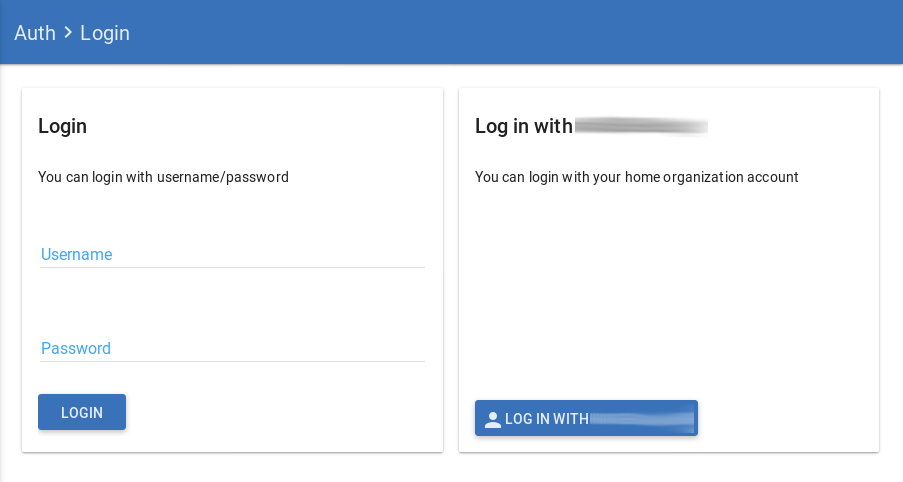
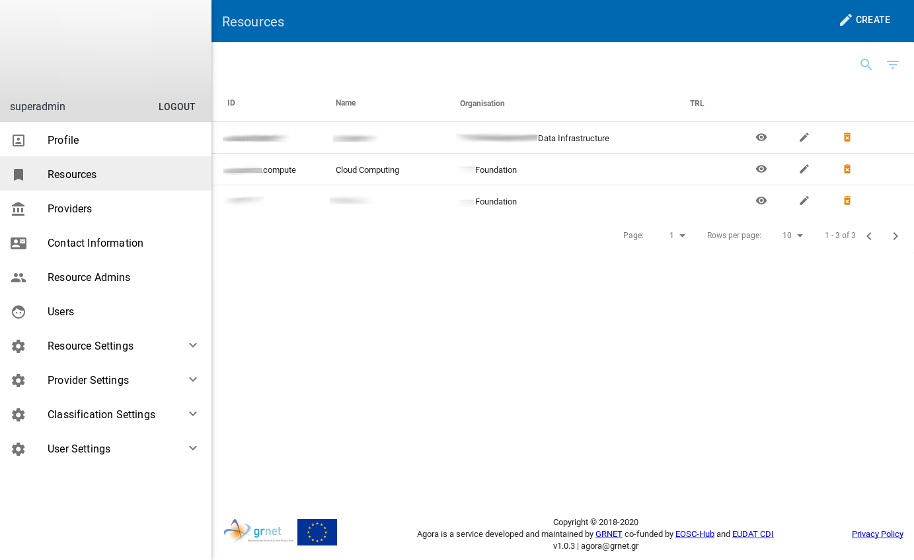

Agora there are two ways to login:

* Basic authentication : Where user credentials are stored in the local database and verified from there.

* Authentication via third party proxy with multiply identity providers ( *using Shibboleth* ) : In this case, an external trusted provider authenticates the user.

**All users except the *superuser* will register and log in via the respective provider.**

|  |
|:----------------------------------:|
| *Login page* |

|  |
|:----------------------------------:|
| *First screen after a successful login* |

Authentication and Authorization
=================================

A new user who has just registered on Agora, acquires only the right of access to the service as an observer.
That is why it automatically enters the category of `Observer` users.
To grant more permissions, these it must be assigned by a `Superadmin` user.
See below the categories of users that exist as well as their respective rights.

## User categories

### Superadmin
Administers the whole system.

* Profile                       : Can only see their own personal information.
* Resources                     : It can create/edit/delete resources for all Resource Organizations (without any restrictions).
* Providers                     : It can create/edit/delete provider (without any restrictions).
* Contact Information           : It can create/edit/delete Contact Information *for all Providers* (without any restrictions).
* Resource Admins               : It can create/edit/delete and assign a resource admin to a resource.
* Users                         : It can edit/delete (without any restrictions).
* Resource Settings             : It can create/edit/delete everywhere.
* Provider Settings             : It can create/edit/delete everywhere.
* Classification Settings       : It can create/edit/delete everywhere.
* User Settings -> Target Users : It can create/edit/delete everywhere.

### Admin
Allowed to do whatever a Resource Admin can do besides Delete.

* Profile                       : Can only see their own personal information.
* Resources                     : It can create/edit resources for all Resource Organizations (without any restrictions).
* Providers                     : It can create/edit provider (without any restrictions).
* Contact Information           : It can create/edit Contact Information *for all Providers* (without any restrictions).
* Resource Admins               : It can create/edit and assign a resource admin to a resource.
* Users                         : It can edit (without any restrictions).
* Resource Settings             : It can create/edit everywhere.
* Provider Settings             : It can create/edit everywhere.
* Classification Settings       : It can create/edit everywhere.
* User Settings -> Target Users : It can create/edit everywhere.

### Resource Admin
- Each Resource Admin belongs only to one provider
- Each Resource Admin is allowed to edit delete update his own resources (i.e. Resources he/she created or given Rights too)
- Each Resource Admin is allowed to apply to gain rights in other resources in his provider.
- Each Resource Admin is able also to approve or deny rights to other Resource Admins to his/her resource

* Profile                       : Can only see their own personal information.
* Resources                     : It can create *new* resources, but *only for the Resource Organization to which it belongs*.
* My Resources                  : It can create *new* resources, but *only for the Resource Organization to which it belongs*.
* Providers                     : It can only view τους υπάρχων providers.
* Contact Information           : It can create new Contact Information, but *only for the Provider to which it belongs*.
* Resource Admins               : It can only view existing resource admins in the Resource Organization to which it belongs.
* Resource Settings             : It can only view.
* Provider Settings             : It can only view.
* Classification Settings       : It can only view.
* User Settings -> Target Users : It can only view.

### Observer
Has Only view rights.

* Profile                       : Can only see their own personal information.
* Resources                     : It can only view **all entries**.
* Providers                     : It can only view **all entries**.
* Contact Information           : It can only view **all entries**.
* Resource Admins               : It can only view existing resource admins in the Resource Organization to which it belongs.
* Resource Settings             : It can only view.
* Provider Settings             : It can only view.
* Classification Settings       : It can only view.
* User Settings -> Target Users : It can only view.
