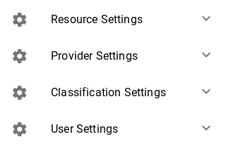
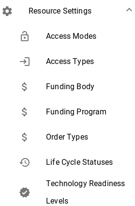
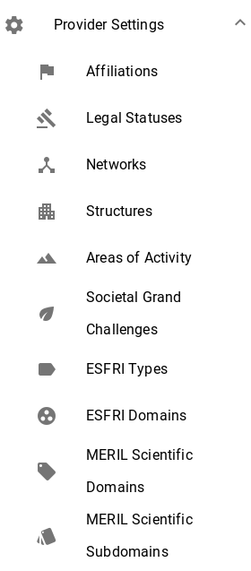
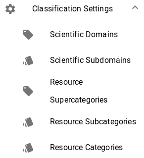
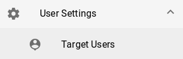

**Settings menus**: In these menus a `Superadmin` user can view, edit and delete many of the values from specific fields that are available when creating a resource or provider.

|  |
|:--------------------:|
| *All settings menus* |

## Resource Settings
The submenus of this menu host the available options of the following fields when creating a new **resource**.
Each submenu corresponds to the following fields :
* `ERP.CLI.6 - Access Type`
* `ERP.CLI.7 - Access Mode`
* `ERP.ATI.1 - Funding Body`
* `ERP.ATI.2 - Funding Program`
* `ERP.AOI.1 - Order Type`
* `ERP.MTI.2 - Life Cycle Status`
* `ERP.MTI.1 - Technology Readinness Level`

|  |
|:--------------------:|
| *Resource Settings* |

## Provider Settings
The submenus of this menu host the available options of the following fields when creating a new **provider**.
Each submenu corresponds to the following fields :
* `EPP.OTH.3 - Affiliations`
* `EPP.OTH.4 - Networks`
* `EPP.CLI.4 - Structure Type`
* `EPP.BAI.5 - Legal Status`
* `EPP.OTH.10 - Areas of activity`
* `EPP.OTH.11 - Societal Grand challenges`
* `EPP.OTH.6 - ESFRI Domain`
* `EPP.OTH.7 - ESFRI Type`
* `EPP.OTH.8 - MERIL Scientific Domain`
* `EPP.OTH.9 - MERIL Scientific Subdomain`

|  |
|:--------------------:|
| *Provider Settings* |

## Classification Settings
The submenus of this menu host the available options of the following fields when creating a new **provider** or **resource**.
> When creating a new resource or provider there are some common areas.

Each submenu corresponds to the following fields :

Resource -> `Classification Information` :
* `ERP.CLI.1 - Scientific Domain`
* `ERP.CLI.2 - Scientific Subdomain`
* `ERP.CLI.3 - Category`
* `ERP.CLI.4 - Subcategory`

Provider  -> `Classification Information` :
* `EPP.CLI.1 - Scientific Domain`
* `EPP.CLI.2 - Scientific Subdomain`

|  |
|:--------------------:|
| *Classification Settings* |

## User Settings
This menu host the available options of the following field when creating a new **resource**.

* `ERP.CLI.5 - Target Users`

|  |
|:--------------------:|
| *User Settings* |
