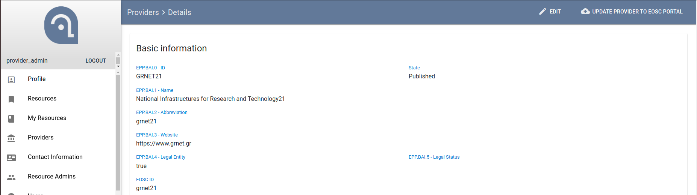
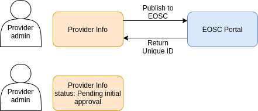
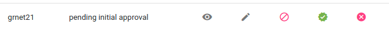
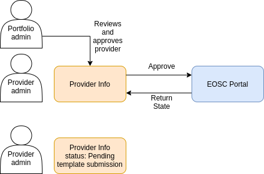
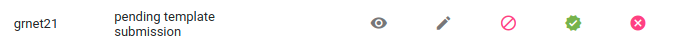
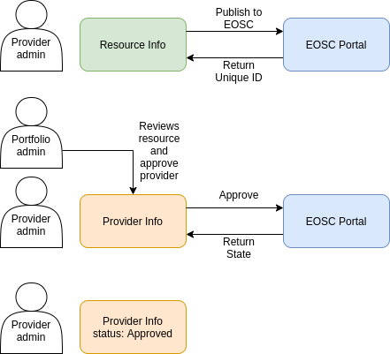

## EOSC Portal

The EOSC Portal ([eosc-portal.eu](https://eosc-portal.eu/)) will be Europe’s virtual environment for all researchers to store, manage, analyse and re-use data for research, innovation and educational purposes.

EOSC is intended to set off the ground by federating existing scientific data infrastructures and digital infrastructures for data exploitation that are now spread across disciplines and EU member states.

This will make access to scientific data and other scientific outputs easier and more efficient.


## Agora Integration with EOSC API

The EOSC provides a public api to allow regional and thematic catalogues to on-board providers and resources to the EOSC Portal: [providers.eosc-portal.eu](https://providers.eosc-portal.eu/developers).


## Vocabulary

In order to be able to send and receive data with eosc API we had to match our fixtures that we use in agora with the EOSC API Vocabulary.
As a result the field `eosc_id` was added in the fixtuers for each entry.
```json
//For example an entry from resource categories you can see the eosc_id in the data model.
{
    "fields": {
        "name": "Data",
        "supercategory": "6c609f4c-22ea-44ae-967f-c8921cbf84b0",
        "eosc_id": "category-sharing_and_discovery-data"
    },
    "model": "service.category",
    "pk": "09148c1e-775a-4925-9e5c-3df2375cb9d8"
}
```


## Profiles 3.0

An important aspect of the integration with the EOSC API are the models of the resources and the Profiles. EOSC API had standardized the models of the resources and providers with profiles 3.0 with mandatory or not fields that someone have to provider to describe a resource/provider.
Find the profiles 3.0 description here: [Profiles 3.0](https://docs.google.com/spreadsheets/d/1o3vhia3Fl1ULbn0CI0nSusZkZ-PDnfvCW_l76c7X4yo/edit#gid=0)


## Publishing

The flow of the publishing to eosc API follows these steps:
1. The Superadmin creates a new provider
2. The Superadmin assignes the role of the provider admin to a user
3. The Provider admin can edit the provider and publish it to eosc

|  |
|:-------------------------------------:|
| *A published provider has an eosc id* |




## Approval

Tho following flow had the assumption that a provider will need to have a resource. (This assumption may change in the near future)
1. The Porfolio admin will review the provider and approve it to a temporary state.
   
   
2. The provider admin will have to publish a resource of its provider
   
   
3. Then the Portfolio admin will do the final approval which will set also the resource's state to approved
   

You can then view the deployed providers and resources to eosc marketplace.
