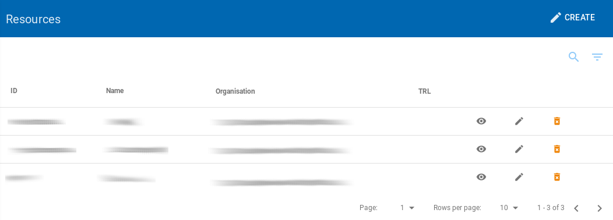
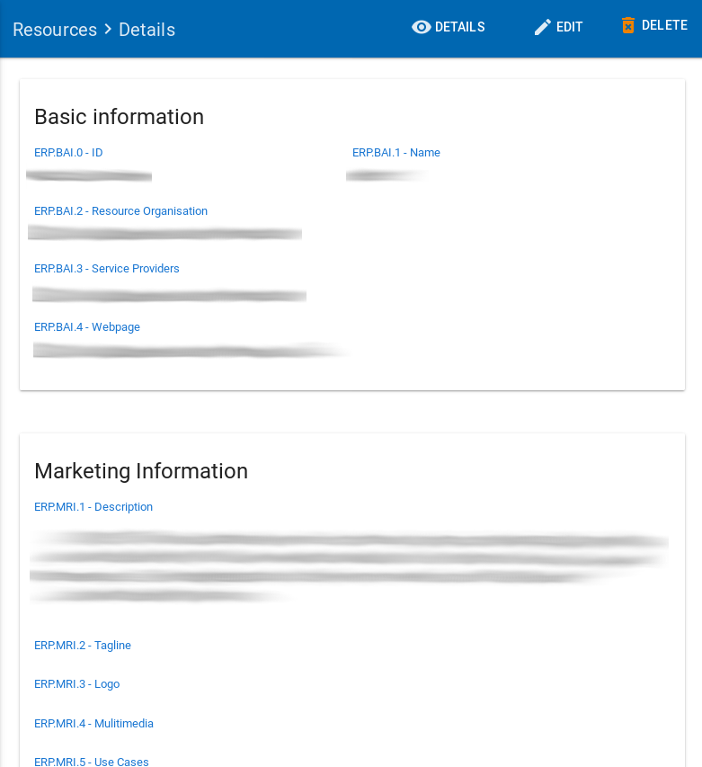

**Resource**: Any asset made available (by means of the EOSC system and according to the EOSC Rules of Participation) to  System Users to perform a process useful to deliver value in the context of the EOSC.
Resources include assets like services, datasets, software, support, training, and consultancy.

## List Resources

To view the list of all resources, the user must click to the **Resources** left sidebar menu option.

|  |
|:--------------------:|
| *The resources page* |

## Resource Details

The user can view all the information from a selected resource by clicking on the details view  icon.

|  |
|:--------------------:|
| *The details from a resource* |

## Create a new Resource

To create a new Resource, a `Superadmin`, `Provider Admin` or `Service Admin` user must click to the **Resources** left sidebar menu option.
When the user clicks to the Resource option, a new page with the list of existing Resources is presented.
From this page a user may create a new resource just by clicking the **Create** option on the top right.

|  |
|:--------------------------:|
| *Create new resource page* |

:::tip

A `Service Admin` user can create a new resource only for his/her organization.

:::

In this new page the `Superadmin`, `Provider Admin` or`Service Admin` user have to fill a number of fields in order to provide the resource details.

As you can see, each field has its own detailed description of what kind of data is expected to be filled in by the user.
For this reason, here we will only mention what are the required fields to be filled in a resource.

Below is the list of fields with small descriptions of the fields. The required fields are also mentioned in this table.

| Field Name                  | Description |
| --------------------------- | --------------------------------------------------------------------------------------------- |
| **Basic information**       |                                                                                               |
| ERP.BAI.0 - ID	(**required**)						|	Global unique and persistent identifier of the service/resource.										|
| ERP.BAI.1 - Name   (**required**)					|	Brief and descriptive name of service/resource as assigned by the service/resource provider.			|
| ERP.BAI.2 - Resource Organisation (**required**)			|	The organisation that manages and delivers the service/resource, or the organisation which takes lead in coordinating service delivery and communicates with customers in case of a federated scenario	|
| ERP.BAI.3 - Resource Providers			|	The organisation(s) that participate in service delivery in case of a federated scenario				|
| ERP.BAI.4 - Webpage						|	Webpage with information about the service/resource usually hosted and maintained by the service/resource provider.	|
| **Marketing Information**       |                                                                                            |
| ERP.MRI.1 - Description					|	A high-level description in fairly non-technical terms of a) what the service/resource does, functionality it provides and resources it enables to access, b) the benefit to a user/customer delivered by a service; benefits are usually related to alleviating pains (e.g., eliminate undesired outcomes, obstacles or risks) or producing gains (e.g. increased performance, social gains, positive emotions or cost saving), c) list of customers, communities, users, etc. using the service.	|
| ERP.MRI.2 - Tagline						|	Short catch-phrase for marketing and advertising purposes. It will be usually displayed close the service name and should refer to the main value or purpose of the service.	|
| ERP.MRI.3 - Logo							|	Link to the logo/visual identity of the service. The logo will be visible at the Portal.				|
| ERP.MRI.4 - Mulitimedia					|	Link to video, screenshots or slides showing details of the service/resource.							|
| ERP.MRI.5 - Use Cases						|	List of use cases supported by this service/resource.													|
| **Classification Information**  |                                                                                      |
| ERP.CLI.1 - Scientific Domain (**required**)				|	The branch of science, scientific discipline that is related to the service/resource.					|
| ERP.CLI.2 - Scientific Subdomain  (**required**)			|	The subbranch of science, scientific subdicipline that is related to the service/resource.				|
| ERP.CLI.3 - Category  (**required**)						|	A named group of services/resources that offer access to the same type of resource or capabilities.		|
| ERP.CLI.4 - Subcategory (**required**)					|	A named group of services/resources that offer access to the same type of resource or capabilities, within the defined service category	|
| ERP.CLI.5 - Target Users					|	Type of users/customers that commissions a service/resource provider to deliver a service.				|
| ERP.CLI.6 - Access Type					|	The way a user can access the service/resource (Remote, Physical, Virtual, etc.)						|
| ERP.CLI.7 - Access Mode					|	Eligibility/criteria for granting access to users (excellence-based, free-conditionally, free etc.)		|
| ERP.CLI.8 - Tags							|	Keywords associated to the service/resource to simplify search by relevant keywords.					|
| **Management Information**    |                                                                                      |
| ERP.MGI.1 - Heldesk Page					|																											|
| ERP.MGI.2 - User Manual					|	Link to the service/resource user manual and documentation.												|
| ERP.MGI.3 - Terms of Use					|	Webpage describing the rules, service/resource conditions and usage policy which one must agree to abide by in order to use the service.	|
| ERP.MGI.4 - Privacy Policy				|	Link to the privacy policy applicable to the service.													|
| ERP.MGI.5 - Access Policy					|	Information about the access policies that apply.														|
| ERP.MGI.6 - Service Level					|	Webpage with the information about the levels of performance that a service/resource provider is expected to deliver.	|
| ERP.MGI.7 - Training Information			|	Webpage to training information on the service.															|
| ERP.MGI.8 - Status Monitoring				|	Webpage with monitoring information about this service													|
| ERP.MGI.9 - Maintenance					|	Webpage with information about planned maintenance windows for this service								|
| **Geographical and Language Availability Information**    |                                                                 |
| ERP.GLA.1 - Geographical Availability		|	Locations where the service/resource is offered.														|
| ERP.GLA.2 - Language Availability			|	Languages of the user interface of the service or the resource.											|
| **Resource Location Information**    |                                                                 |
| ERP.RLI.1 - Resource Geographic Location	|	List of geographic locations where data is stored and processed											|
| **Contact Information**    |                                                                 |
| Main Contact/Resource Owner				|																											|
| Public Contact							|																											|
| ERP.COI.13 - Helpdesk Email				|	Email of the heldpesk department.																		|
| ERP.COI.14 - Security Contact Email		|																											|
| **Maturity Information**    |                                                                 |
| ERP.MTI.1 - Technology Readinness Level	|	The Technology Readiness Level of the Tag of the service/resource.	|
| ERP.MTI.2 - Life Cycle Status				|																											|
| ERP.MTI.3 - Certifications				|	List of certifications obtained for the service (including the certification body).	|
| ERP.MTI.4 - Standards						|	List of standards supported by the service.	|
| ERP.MTI.5 - Open Source Technologies		|	List of open source technologies supported by the service.	|
| ERP.MTI.6 - Version						|	Version of the service/resource that is in force.	|
| ERP.MTI.7 - Last Update					|	Date of the latest update of the service/resource.	|
| ERP.MTI.8 - Changelog						|	Summary of the service/resource features updated from the previous version.	|
| **Dependencies Information**    |                                                                 |
| ERP.DEI.1 - Required Resources			|																											|
| ERP.BAI.0 - ID							|																											|
| ERP.BAI.1 - Name							|																											|
| ERP.BAI.2 - Resource Organisation			|																											|
| ERP.DEI.2 - Related Resources				|																											|
| ERP.BAI.0 - ID							|																											|
| ERP.BAI.1 - Name							|																											|
| ERP.BAI.2 - Resource Organisation			|																											|
| ERP.DEI.3 - Related Platforms				|	List of suites or thematic platforms in which the service/resource is engaged or providers (provider groups) contributing to this service	|
| **Attribution Information**    |                                                                 |
| ERP.ATI.1 - Funding Body					|	Name of the funding body that supported the development and/or operation of the service.				|
| ERP.ATI.2 - Funding Program				|	Name of the funding program that supported the development and/or operation of the service.				|
| ERP.ATI.3 - Grant/Project Name			|	Name of the project that supported the development and/or operation of the service.						|
| **Access and Order Information**    |                                                                 |
| ERP.AOI.1 - Order Type					|																											|
| ERP.AOI.2 - Order							|																											|
| **Financial Information**    |                                                                 |
| ERP.FNI.1 - Payment Model					|	Webpage with the supported payment models and restrictions that apply to each of them					|
| ERP.FNI.2 - Pricing						|	Webpage with the information on the price scheme for this service in case the customer is charged for.	|

## Edit a Resource

The `superadmin`, `admin` and `Service Admin` have the permission to edit a Resource.

To edit an existing Resource, the user should visit the list of Resources.

By clicking on the edit  icon near the selected resource the user can edit the details of it.

The fields that the user can change are the same as the ones described in the previous section "Create new resource" .

## Delete a Resource

Only `Superadmin` has the permission to delete a Resource.
To delete an existing Resource, the user should visit the list of Resources. By clicking on the delete  icon near the selected resource  
the user can delete it.

|  |
|:--------------------------:|
| *The page will show you a confirmation message and if you agree, then this entry will be deleted.* |
