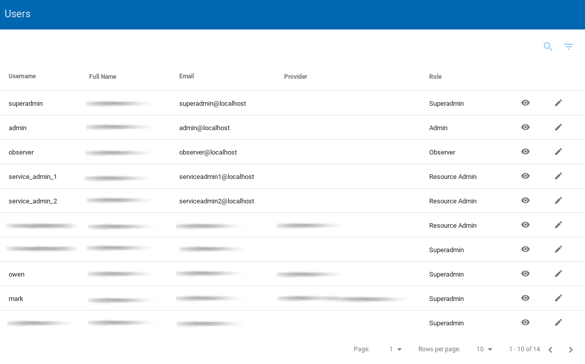

**Users**: Users are the users of this service. 

The service supports the following types of users 

 - Super Admin: The one that administers the whole system
 - Admin: who can read/modify/delete everything
 - Resource admin: who can read everything; can modify/delete services that he is owner/manager of
 - Observer: who can read everything

## List Users
To view the list of all users, a `superadmin` or `admin` or user must click to the **Users** left sidebar menu option.

|  |
|:--------------------------------------:|
| *The user page from a admin user* |

## View User Details
The user can view all the information from a selected user by clicking on the details view  icon.

|  |
|:--------------------:|
| *The details from a user* |

## Edit User

The `superadmin` or `admin` have the permission to edit a user.

To edit an existing user, the user should visit the list of Users.

By clicking on the edit  icon near the selected user the user can edit the details of it.

The fields that the user can change :

| Field Name                  | Description           |
| --------------------------- | ----------------------|
| **Basic information**       |                       |
| Username (**required**)			|	A username						|
| First Name (**required**)		|	The user's first name	|
| Last Name (**required**)		|	The user'sLast name		|
| Email (**required**)				|	The user's email 			|
| Role (**required**)					|	The role of the user  |

> **Important note** :
> * `superadmin` user, can view/edit and delete a user.
> * `admin` users can only view and edit the existing users.

|  |
|:--------------------------------------:|
| *The user page from a admin user* |

## Delete User

Only the `superadmin`, have the permission to delete a user.

|  |
|:--------------------------------------:|
| *The user page from a superadmin user* |

To delete an existing user, the `superadmin` user should visit the list of Users. By clicking on the delete  icon near the selected user the user can delete it.

|  |
|:--------------------------:|
| *The page will show you a confirmation message and if you agree, then this entry will be deleted.* |
